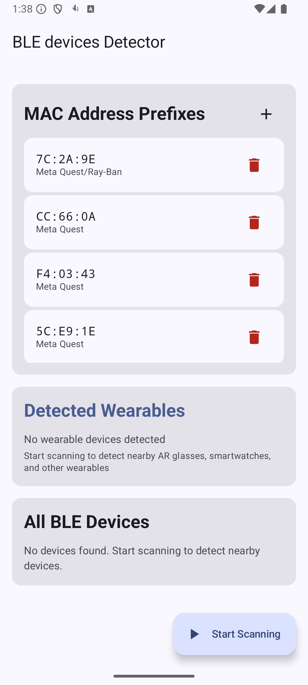
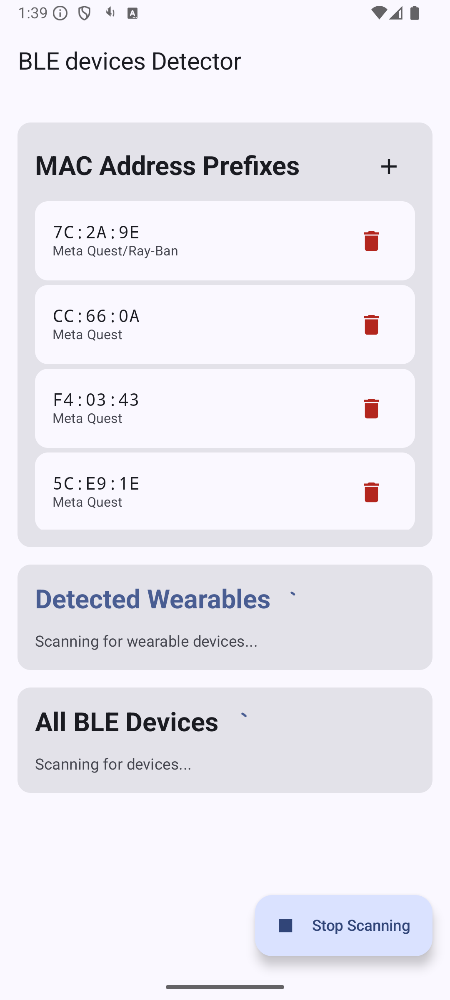
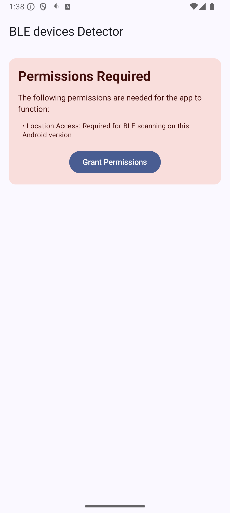

# Smart Devices Detector

An Android app built with Jetpack Compose and Kotlin that scans for BLE devices matching specific MAC address prefixes or Manufacturer IDs and displays notifications when target devices are detected.

| Main screen         | Scanning                | Permission request        |
|---------------------|-------------------------|---------------------------|
|  |  |  |


## Features

- **BLE Scanning**: Continuously scans for nearby Bluetooth Low Energy devices
- **Detection Criteria**: 
  - **MAC Prefix Filtering**: Configure specific MAC address prefixes (e.g., `24:F0:94`)
  - **Manufacturer ID Filtering**: Detect devices using specific Manufacturer IDs (e.g., `0x01AB`)
- **Background Operation**: Runs as a foreground service to scan even when the app is in the background
- **Notification System**: Shows notifications when matching devices are found
- **Permission Management**: Handles all necessary BLE and location permissions automatically
- **Modern UI**: Clean Jetpack Compose interface for configuration and monitoring

## Requirements

- Android 10 (API level 29) or higher
- Device with Bluetooth Low Energy support
- Location services enabled (required for BLE scanning)

## Permissions

The app requires the following permissions:
- **Bluetooth permissions**: For BLE scanning and device identification
- **Location permission**: Required by Android for BLE scanning
- **Notification permission**: To display device found notifications (Android 13+)
- **Foreground service permission**: To run background scanning

## How to Use

1. **Install and Launch**: Install the app and launch it
2. **Grant Permissions**: The app will request all necessary permissions on first launch
3. **Configure Detection Criteria**: 
   - Tap the **+** button on the main screen.
   - **MAC Prefix**: Toggle to MAC mode and enter the first few bytes (e.g., "24:F0:94").
   - **Manufacturer ID**: Toggle to Manufacturer ID mode and enter the 2-byte hex ID (e.g., "0x01AB").
   - You can add multiple criteria to detect different device types.
4. **Start Scanning**: Tap the "Start Scanning" button to begin background BLE scanning
5. **Receive Notifications**: When a matching device is detected, you'll receive a notification

## Detection Criteria Explained

### MAC Address Prefixes
The first few characters of a device's MAC address identify the manufacturer. This is useful for detecting devices from a specific brand (like Meta Quest or Ray-Ban glasses).

### Manufacturer IDs
Manufacturer IDs are 16-bit identifiers assigned by the Bluetooth SIG. Many "smart" devices broadcast this ID in their advertisement data. This app allows you to target specific hardware IDs like `0x01AB`, `0x058E`, or `0x0D53`.

## Architecture

The app consists of:
- **MainActivity**: Main UI entry point with Jetpack Compose
- **BleScanner**: Core BLE scanning logic with prefix and Manufacturer ID matching
- **BleScanService**: Foreground service for background scanning
- **NotificationHelper**: Manages device found notifications
- **MacPrefixRepository**: Persistent storage for detection criteria using DataStore
- **PermissionManager**: Handles runtime permission requests

## Technical Details

- **Min SDK**: 29 (Android 10)
- **Target SDK**: 36
- **Language**: Kotlin
- **UI Framework**: Jetpack Compose
- **Background Processing**: Foreground Service
- **Data Storage**: DataStore Preferences
- **Architecture**: MVVM with StateFlow

## Building

```bash
./gradlew build
```

## Installation

```bash
./gradlew installDebug
```

## Notes

- The app uses a foreground service to ensure continuous scanning even when the app is in the background
- BLE scanning has power management considerations - the app uses low power scan mode to balance detection and battery life
- Some devices may have MAC address randomization enabled, which can affect detection reliability
- Location permission is required by Android for BLE scanning, but the app doesn't actually use location services
